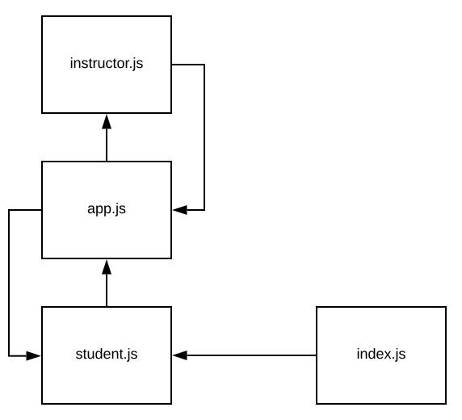

# LAB - 18 

## Socket.io

### Author: David Vloedman

### Links and Resources
* [submission PR](https://github.com/david-vloedman-401-advanced-javascript/401-lab-18/pull/1)
* [travis](https://www.travis-ci.com/david-vloedman-401-advanced-javascript/401-lab-18)

#### Documentation

* [JSDocs](./docs/index.html)

### Setup

* Clone repo

#### How to initialize/run your server app (where applicable)

node server.js
node instructor.js
node student.js

npm run
  
#### Tests

npm test

#### UML

